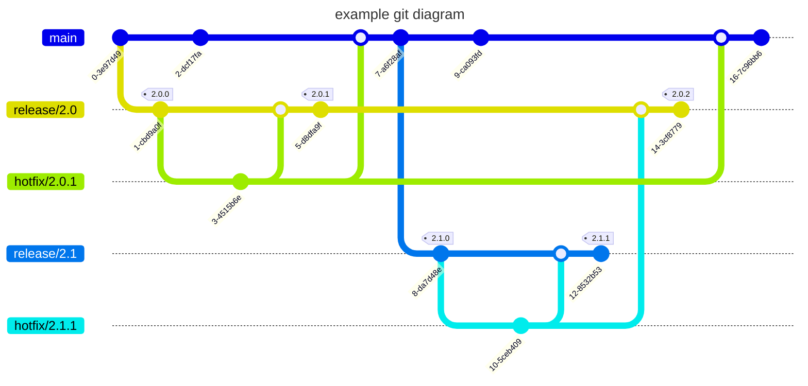

```mermaid 
---
title: example git diagram
---
gitGraph
	commit

	branch release/2.0
	checkout release/2.0
	commit tag: "2.0.0"

	checkout main
	commit
	
	checkout release/2.0
	branch hotfix/2.0.1
	commit

	checkout release/2.0
	merge hotfix/2.0.1
	commit tag: "2.0.1"

	checkout main
	merge hotfix/2.0.1
	commit

	branch release/2.1
	checkout release/2.1
	commit tag: "2.1.0"

	checkout main
	commit

	checkout release/2.1
	branch hotfix/2.1.1
	commit

	checkout release/2.1
	merge hotfix/2.1.1
	commit tag: "2.1.1"

        checkout release/2.0
        merge hotfix/2.1.1
        commit tag: "2.0.2"

	checkout main
	merge hotfix/2.0.1
	commit

```
